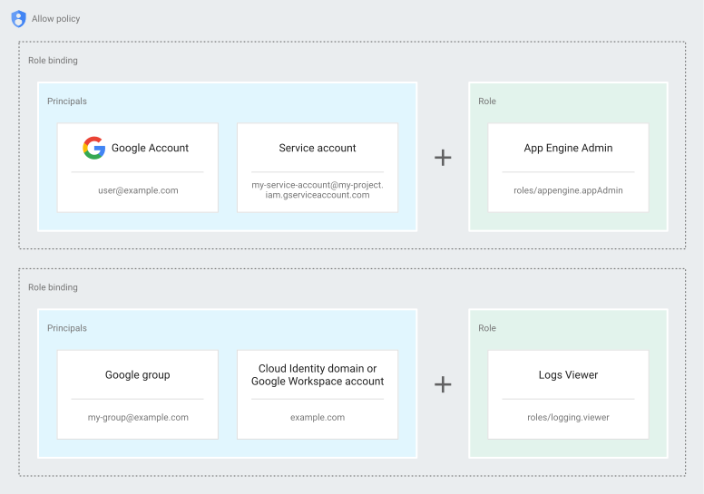
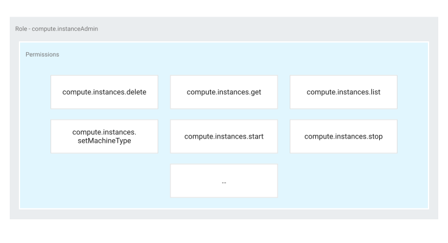
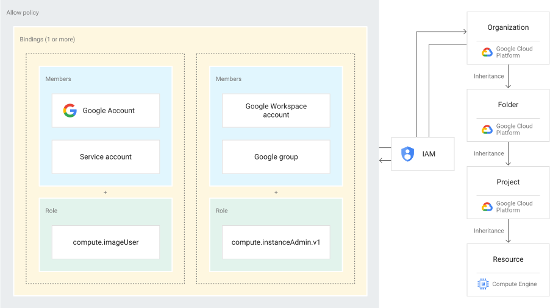

# What is IAM?

IAM lets you grant granular access to specific Google Cloud resources and helps prevent access to other resources. IAM lets you adopt the security principle of least privilege, which states that nobody should have more permissions than they actually need.

# How IAM Works?

With IAM, you manage access control by defining _who_ (identity) has _what access_ (role) for _which resource_. For example, Compute Engine virtual machine instances, Google Kubernetes Engine (GKE) clusters, and Cloud Storage buckets are all Google Cloud resources. The organizations, folders, and projects that you use to organize your resources are also resources.

In IAM, permission to access a resource isn't granted _directly_ to the end user. Instead, permissions are grouped into _roles_, and roles are granted to authenticated _principals_. (In the past, IAM often referred to principals as _members_. Some APIs still use this term.)

An _allow policy_, also known as an _IAM policy_, defines and enforces what roles are granted to which principals. Each allow policy is attached to a resource. When an authenticated principal attempts to access a resource, IAM checks the resource's allow policy to determine whether the action is permitted.



This model for access management has three main parts:

- **Principal**. A _principal_ can be a Google Account (for end users), a service account (for applications and compute workloads), a Google group, or a Google Workspace account or Cloud Identity domain that can access a resource. Each principal has its own identifier, which is typically an email address.
- **Role**. A _role_ is a collection of permissions. Permissions determine what operations are allowed on a resource. When you grant a role to a principal, you grant all the permissions that the role contains.
- **Policy**. The _allow policy_ is a collection of role bindings that bind one or more principals to individual roles. When you want to define who (principal) has what type of access (role) on a resource, you create an allow policy and attach it to the resource.

In the preceding diagram, for example, the allow policy binds principals, such as `user@example.com`, to roles, such as the App Engine Admin role (`roles/appengine.appAdmin`). If the allow policy is attached to a project, the principals gain the specified roles within the project.

The rest of this page describes these concepts in greater detail.

## Concepts related to identity

In IAM, you grant access to _principals_. Principals can be of the following types:

- Google Account
- Service account
- Google group
- Google Workspace account
- Cloud Identity domain
- All authenticated users
- All users

### Google Account

A Google Account represents a developer, an administrator, or any other person who interacts with Google Cloud. Any email address that's associated with a Google Account can be an identity, including gmail.com or other domains.

### Service account

A service account is an account for an application or compute workload instead of an individual end user. When you run code that's hosted on Google Cloud, the code runs as the account you specify. You can create as many service accounts as needed to represent the different logical components of your application.

### Google group

A Google group is a named collection of Google Accounts and service accounts. Every Google group has a unique email address that's associated with the group. You can find the email address that's associated with a Google group by clicking **About** on the homepage of any Google group

Google Groups are a convenient way to apply access controls to a collection of users. You can grant and change access controls for a whole group at once instead of granting or changing access controls one at a time for individual users or service accounts. You can also easily add principals to and remove principals from a Google group instead of updating an allow policy to add or remove users.

Google Groups don't have login credentials, and you cannot use Google Groups to establish identity to make a request to access a resource.

### Google Workspace account

A Google Workspace account represents a virtual group of all of the Google Accounts that it contains. Google Workspace accounts are associated with your organization's internet domain name, such as `example.com`. When you create a Google Account for a new user, such as `username@example.com`, that Google Account is added to the virtual group for your Google Workspace account.

Like Google Groups, Google Workspace accounts cannot be used to establish identity, but they enable convenient permission management.

### Cloud Identity domain

A Cloud Identity domain is like a Google Workspace account, because it represents a virtual group of all Google Accounts in an organization. However, Cloud Identity domain users don't have access to Google Workspace applications and features.

### All authenticated users

The value `allAuthenticatedUsers` is a special identifier that represents all service accounts and all users on the internet who have authenticated with a Google Account. This identifier includes accounts that aren't connected to a Google Workspace account or Cloud Identity domain, such as personal Gmail accounts. Users who aren't authenticated, such as anonymous visitors, aren't included.

## Concepts related to access management

When an authenticated principal attempts to access a resource, IAM checks the resource's allow policy to determine whether the action is allowed.

This section describes the entities and concepts involved in the authorization process.

### Resource

If a user needs access to a specific Google Cloud resource, you can grant the user a role for that resource.

Some services support granting IAM permissions at a granularity finer than the project level. For example, you can grant the Storage Admin role (`roles/storage.admin`) to a user for a particular Cloud Storage bucket, or you can grant the Compute Instance Admin role (`roles/compute.instanceAdmin`) to a user for a specific Compute Engine instance.

In other cases, you can grant IAM permissions at the project level. The permissions are then inherited by all resources within that project. For example, to grant access to all Cloud Storage buckets in a project, grant access to the project instead of each individual bucket. Or to grant access to all Compute Engine instances in a project, grant access to the project rather than each individual instance.

### Permissions

Permissions determine what operations are allowed on a resource. In the IAM world, permissions are represented in the form of `service.resource.verb`, for example, `pubsub.subscriptions.consume`.

Permissions often correspond one-to-one with REST API methods. That is, each Google Cloud service has an associated set of permissions for each REST API method that it exposes. The caller of that method needs those permissions to call that method. For example, if you use Pub/Sub, and you need to call the `topics.publish()` method, you must have the `pubsub.topics.publish` permission for that topic.

### Roles

A role is a collection of permissions. You cannot grant a permission to the user directly. Instead, you grant them a role. When you grant a role to a user, you grant them all the permissions that the role contains.



There are several kinds of roles in IAM:

- **Basic roles**: Roles historically available in the Google Cloud console. These roles are Owner, Editor, and Viewer.
- **Predefined roles**: Roles that give finer-grained access control than the basic roles. For example, the predefined role Pub/Sub Publisher (`roles/pubsub.publisher`) provides access to _only_ publish messages to a Pub/Sub topic.
- **Custom roles**: Roles that you create to tailor permissions to the needs of your organization when predefined roles don't meet your needs.

### Allow policy

You can grant roles to users by creating an _allow policy_, which is a collection of statements that define who has what type of access. An allow policy is attached to a resource and is used to enforce access control whenever that resource is accessed.



An allow policy consists of a list of role bindings. A role binding binds a list of principals to a role.

- `role`: The role you want to grant to the principal. `role` is specified in the form of `roles/service.roleName`. For example, Cloud Storage provides the roles `roles/storage.objectAdmin`, `roles/storage.objectCreator`, and `roles/storage.objectViewer`, among others.
- `members`: A list of one or more principals as described in the [Concepts related to identity](https://cloud.google.com/iam/docs/overview#concepts_related_identity) section in this document. Each principal type is identified with a prefix, such as a Google Account (`user:`), service account (`serviceAccount:`), Google group (`group:`), or a Google Workspace account or Cloud Identity domain (`domain:`). In the following example code snippet, the `storage.objectAdmin` role is granted to the following principals by using the appropriate prefix: `user:ali@example.com`, `serviceAccount:my-other-app@appspot.gserviceaccount.com`, `group:admins@example.com`, and `domain:google.com`. The `objectViewer` role is granted to `user:maria@example.com`.

The following code snippet shows the structure of an allow policy.

```
{
  "bindings": [
    {
		"role": "roles/storage.objectAdmin",      
		"members": [        
			"user:ali@example.com",
			"serviceAccount:my-other-app@appspot.gserviceaccount.com",
			"group:admins@example.com",        
			"domain:google.com"      
		]    
	},    
	{
		"role": "roles/storage.objectViewer",      
		"members": [        
		      "user:maria@example.com"      
		  ]    
	}
  ]
}
```
