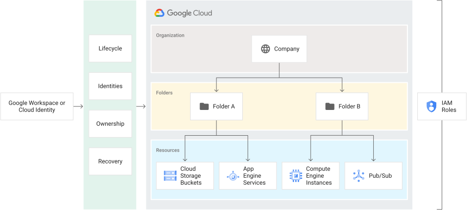

# What is Resource Manager?

Google Cloud provides container resources such as organizations and projects that allow you to group and hierarchically organize other Google Cloud resources. This hierarchical organization helps you manage common aspects of your resources, such as access control and configuration settings. The Resource Manager API enables you to programmatically manage these container resources.

The purpose of the Google Cloud resource hierarchy is two-fold:
- Provide a hierarchy of ownership, which binds the lifecycle of a resource to its immediate parent in the hierarchy.
- Provide attach points and inheritance for access control and organization policies.

Metaphorically speaking, the Google Cloud resource hierarchy resembles the file system found in traditional operating systems as a way of organizing and managing entities hierarchically. Generally, each resource has exactly one parent. This hierarchical organization of resources enables you to set access control policies and configuration settings on a parent resource, and the policies and Identity and Access Management (IAM) settings are inherited by the child resources.

### Google Cloud resource hierarchy in detail

Google Cloud resources are organized hierarchically. All resources except for the highest resource in a hierarchy have exactly one parent. At the lowest level, service resources are the fundamental components that make up all Google Cloud services. Examples of service resources include Compute Engine Virtual Machines (VMs), Pub/Sub topics, Cloud Storage buckets, App Engine instances. All these lower level resources have project resources as their parents, which represent the first grouping mechanism of the Google Cloud resource hierarchy.

All users, including free trial users, free tier users, and Google Workspace and Cloud Identity customers, can create project resources. Users of the [Google Cloud Free Program](https://cloud.google.com/free) can only create project resources and service resources within projects. Project resources can be the top of their hierarchy, but only if created by a free trial user or free tier user. Google Workspace and Cloud Identity customers have access to additional features of the Google Cloud resource hierarchy, such as organization and folder resources. Learn more in the [overview of Cloud Identity](https://cloud.google.com/identity/docs/overview). Project resources at the top of their hierarchy do not have parent resources, but they can be migrated into an organization resource once it has been created for the domain. For more details about migrating project resources, see [Migrating project resources](https://cloud.google.com/resource-manager/docs/project-migration).

Google Workspace and Cloud Identity customers can create organization resources. Each Google Workspace or Cloud Identity account is associated with one organization resource. When an organization resource exists, it is the top of the Google Cloud resource hierarchy, and all resources that belong to an organization are grouped under the organization resource. This provides central visibility and control over every resource that belongs to an organization resource.

Folder resources are an additional, optional grouping mechanism between organization resources and project resources. An organization resource is required as a prerequisite to use folders. Folder resources and their child project resources are mapped under the organization resource.

The Google Cloud resource hierarchy, especially in its most complete form which includes an organization resource and folder resources, allows companies to map their organization resource onto Google Cloud and provides logical attachment points for access management policies (IAM) and [Organization policies](https://cloud.google.com/resource-manager/docs/organization-policy/overview). Both IAM and organization policies are inherited through the hierarchy, and the effective policy for each resource in the hierarchy is the result of policies directly applied on the resource and policies inherited from its ancestors.

The diagram below represents an example Google Cloud resource hierarchy in its complete form:


## The organization resource

The [organization](https://cloud.google.com/resource-manager/reference/rest/v3/organizations) resource represents an organization (for example, a company) and is the root node in the Google Cloud resource hierarchy when present. The organization resource is the hierarchical ancestor of folder and project resources. The IAM access control policies applied on the organization resource apply throughout the hierarchy on all resources in the organization.

Google Cloud users are not required to have an organization resource, but some features of Resource Manager will not be usable without one. The organization resource is closely associated with a [Google Workspace](https://gsuite.google.com/) or [Cloud Identity](https://cloud.google.com/identity) account. When a user with a Google Workspace or Cloud Identity account creates a Google Cloud project resource, an organization resource is automatically provisioned for them.

A Google Workspace or Cloud Identity account can have exactly one organization resource provisioned with it. Once an organization resource is created for a domain, all new Google Cloud project resources created by members of the account domain will by default belong to the organization resource. When a managed user creates a project resource, the requirement is that it must be in _some_ organization resource. If a user specifies an organization resource and they have the right permissions, the project is assigned to that organization. Otherwise, it will default to the organization resource the user is associated with. It is impossible for accounts associated with an organization resource to create project resources that aren't associated with an organization resource.

### Link with Google Workspace or Cloud Identity accounts

For simplicity we will refer to Google Workspace meaning both Google Workspace and Cloud Identity users.

The Google Workspace or Cloud Identity account represents a company and is a prerequisite to have access to the organization resource. In the Google Cloud context, it provides identity management, recovery mechanism, ownership and lifecycle management. The picture below shows the link between the Google Workspace account, Cloud Identity, and the Google Cloud resource hierarchy.



The Google Workspace super admin is the individual responsible for domain ownership verification and the contact in cases of recovery. For this reason, the Google Workspace super admin is granted the ability to assign IAM roles by default. The Google Workspace super admin's main duty with respect to Google Cloud is to assign the Organization Administrator IAM role to appropriate users in their domain. This will create the separation between Google Workspace and Google Cloud administration responsibilities that users typically seek.

### Benefits of the organization resource

With an organization resource, project resources belong to your organization instead of the employee who created the project. This means that the project resources are no longer deleted when an employee leaves the company; instead they will follow the organization resource's lifecycle on Google Cloud.

Furthermore, Organization Administrators have central control of all resources. They can view and manage all of your company's project resources. This enforcement means that there can no longer be shadow projects or rogue admins.

Also, you can grant roles at the organization level, which are inherited by all project and folder resource under the organization resource. For example, you can grant the Network Admin role to your networking team at the organization level, allowing them to manage all the networks in all project resources in your company, instead of granting them the role for all individual project resources.

An organization resource exposed by the Resource Manager API consists of the following:

- An organization resource ID, which is a unique identifier for an organization.
- A display name, which is generated from the primary domain name in Google Workspace or Cloud Identity.
- The creation time of the organization resource.
- The last modified time of the organization resource.
- The owner of the organization resource. The owner is specified when creating the organization resource. It cannot be changed once it is set. It is the Google Workspace customer ID that is specified in the [Directory API](https://developers.google.com/admin-sdk/directory/).

The following code snippet shows the structure of an organization resource:

```
{
	"creationTime": "2020-01-07T21:59:43.314Z",
	"displayName": "my-organization",
	"lifecycleState": "ACTIVE",
	"name": "organizations/34739118321",
	"owner": {
		"directoryCustomerId": "C012ba234"
	}
}
```


The initial IAM policy for a newly created organization resource grants the Project Creator and Billing Account Creator roles to the entire Google Workspace domain. This means users will be able to continue creating project resources and billing accounts as they did before the organization resource existed. No other resources are created when an organization resource is created.

## The folder resource

Folder resources optionally provide an additional grouping mechanism and isolation boundaries between projects. They can be seen as sub-organizations within the organization resource. Folder resources can be used to model different legal entities, departments, and teams within a company. For example, a first level of folder resources could be used to represent the main departments in your organization resource. Since folder resources can contain project resources and other folders, each folder resource could then include other sub-folders to represent different teams. Each team folder could contain additional sub-folders to represent different applications. For more details about using folder resources, see [Creating and managing folder resources](https://cloud.google.com/resource-manager/docs/creating-managing-folders).

If folder resources exist in your organization resource and you have appropriate viewing permissions, you can view them from the Google Cloud console. For more detailed instructions, see [Viewing or listing folder and project resources](https://cloud.google.com/resource-manager/docs/creating-managing-folders#viewing_or_listing_folders_and_projects).

Folder resources allow delegation of administration rights, so for example, each head of a department can be granted full ownership of all Google Cloud resources that belong to their departments. Similarly, access to resources can be limited by folder resource, so users in one department can only access and create Google Cloud resources within that folder resource.

The following code snippet shows the structure of a folder resource:

```
{
	"createTime": "2030-01-07T21:59:43.314Z",
	"displayName": "Engineering",
	"lifecycleState": "ACTIVE",
	"name": "folders/634792535758",
	"parent": "organizations/34739118321"
}
```

Like organization and project resources, folder resources act as a policy inheritance point for IAM and organization policies. IAM roles granted on a folder resource are automatically inherited by all project and folder resources included in that folder.

## The project resource

The project resource is the base-level organizing entity. Organization and folder resources may contain multiple projects. A project resource is required to use Google Cloud, and forms the basis for creating, enabling, and using all Google Cloud services, managing APIs, enabling billing, adding and removing collaborators, and managing permissions.

All project resources consist of the following:

- Two identifiers:
    1. Project resource ID, which is a unique identifier for the project resource.
    2. Project resource number, which is automatically assigned when you create the project. It is read-only.
- One mutable display name.
- The lifecycle state of the project resource; for example, ACTIVE or DELETE_REQUESTED.
- A collection of labels that can be used for filtering projects.
- The time when the project resource was created.

The following code snippet shows the structure of a project resource:

```
{
	"createTime": "2020-01-07T21:59:43.314Z",
	"lifecycleState": "ACTIVE",
	"name": "my-project",
	"parent": {
		"id": "634792535758",
		 "type": "folder"
	},
	"projectId": "my-project",
	"labels": {
		"my-label": "prod"
	},
	"projectNumber": "464036093014"
}
```

In order to interact with most Google Cloud resources, you must provide the identifying project resource information for every request. You can identify a project resource in either of two ways: a project resource ID, or a project resource number (`projectId` and `projectNumber` in the code snippet).

A project resource ID is the customized name you chose when you created the project resource. If you activate an API that requires a project resource, you will be directed to create a project resource or select a project resource using its project resource ID. (Note that the `name` string, which is displayed in the UI, is not the same as the project resource ID.)

A project resource number is automatically generated by Google Cloud. Both the project resource ID and project resource number can be found on the dashboard of the project resource in the Google Cloud console. For information on getting project identifiers and other management tasks for project resources see [Creating and managing project resources](https://cloud.google.com/resource-manager/docs/creating-managing-projects).

The initial IAM policy for the newly created project resource grants the owner role to the creator of the project.

## IAM policy inheritance

Google Cloud offers [IAM](https://cloud.google.com/iam/docs/overview), which lets you assign granular access to specific Google Cloud resources and prevents unwanted access to other resources. IAM lets you control who (**users**) has what access (**roles**) to which **resources** by setting IAM policies on the resources.

You can set an IAM policy at the [organization level](https://cloud.google.com/resource-manager/docs/access-control-org), the [folder level](https://cloud.google.com/resource-manager/docs/access-control-folders), the [project level](https://cloud.google.com/resource-manager/docs/access-control-proj), or (in some cases) the resource level. Resources inherit the policies of the parent resource. If you set a policy at the organization level, it is inherited by all its child folder and project resources, and if you set a policy at the project level, it is inherited by all its child resources.

The effective policy for a resource is the union of the policy set on the resource and the policy inherited from its ancestors. This inheritance is transitive. In other words, resources inherit policies from the project, which inherit policies from the organization resource. Therefore, the organization-resource-level policies also apply at the resource level.


For example, in the resource hierarchy diagram above, if you set a policy on folder "Department Y" that grants Project Editor role to bob@example.com, then Bob will have editor role on projects "Development project," "Test project," and "Production project." Conversely, if you assign alice@example.com the Instance Admin role on project "Test project", she will only be able to manage Compute Engine instances in that project.

Roles are always inherited, and there is no way to explicitly remove a permission for a lower-level resource that is granted at a higher level in the resource hierarchy. Given the above example, even if you were to remove the Project Editor role from Bob on the "Test project", he would still inherit that role from the "Department Y" folder, so he would still have the permissions for that role on "Test project".

The IAM policy hierarchy follows the same path as the Google Cloud resource hierarchy. If you change the resource hierarchy, the policy hierarchy changes as well. For example, moving a project into an organization resource will update the project's IAM policy to inherit from the organization resource's IAM policy. Similarly, moving a project resource from one folder resource to another will change the inherited permissions. Permissions that were inherited by the project resource from the original parent resource will be lost when the project resource is moved to a new folder resource. Permissions set at the destination folder resource will be inherited by the project resource as it is moved.